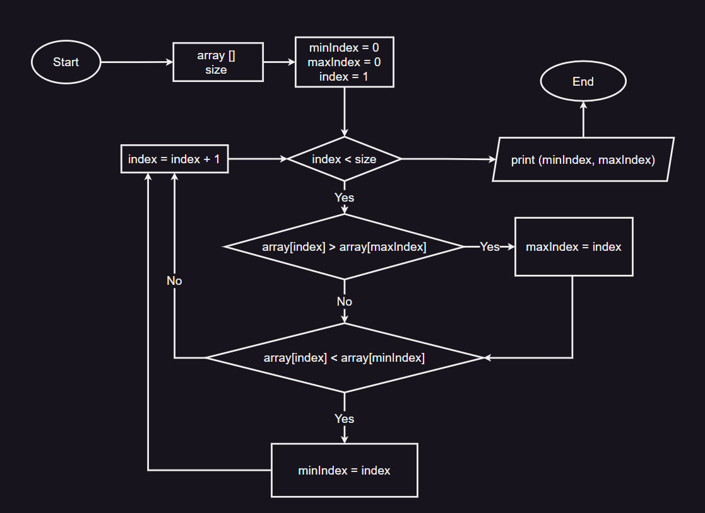
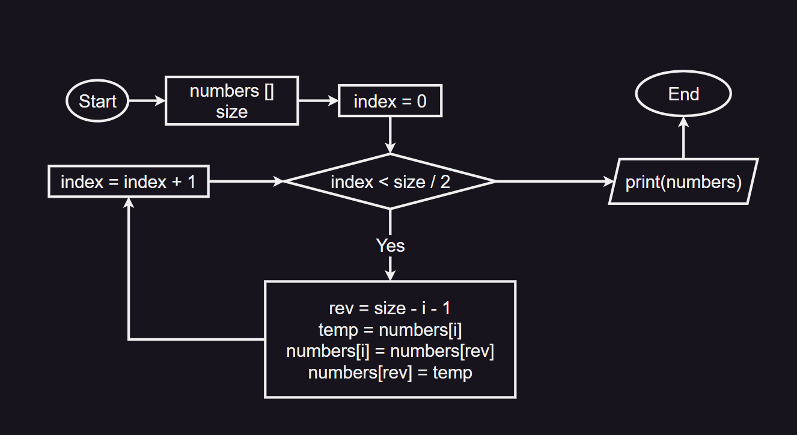
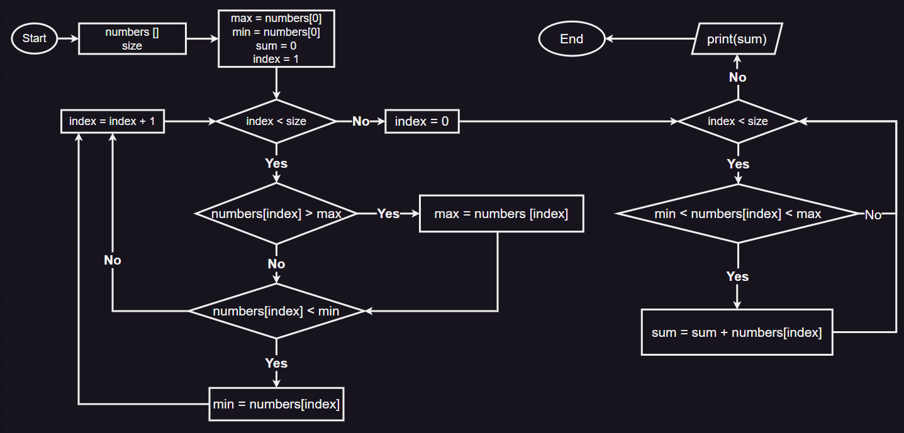
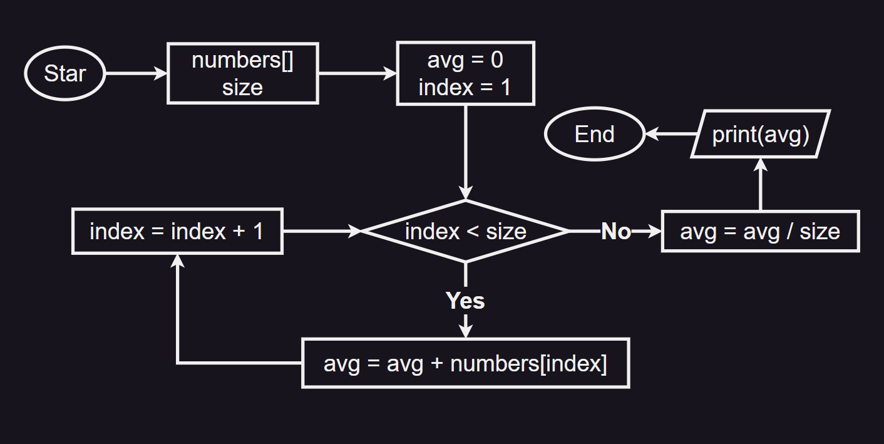

# Домашние задние

## Урок 1

### Задача 3. Составить блок-схему нахождения среднего арифметического из 4-х чисел

### 

### Задача 6. Составить блок-схему нахождения факториала N

### 

## Урок 2

### Задача 1. Нарисовать блок-схему Нахождение индексов максимального и минимального элемента массива

### 

### Задача 2. Нарисовать блок-схему Задание на «разворот» массива. Нужно перевернуть массив и записать его в обратном порядке

### 

### Задача 3** (задача повышенной сложности). Нарисовать блок-схему Найти сумму элементов массива, лежащих между максимальным и минимальным по значению элементами

### 

### Задача 4*. Нарисовать блок-схему Найти среднее арифметическое среди всех элементов массива

### 

## Урок 3 Итоговый проект исходные файлы находятся в папке 03  

### Задача 2. Напишите псевдокод по блок-схеме

```python
numb = [2, 5, 13, 7, 6, 4]
size = 6
summ = 0
avg = 0
index =0
while index < size:
    summ = summ+ numb[index]
    index = index + 1
    
avg = summ / size
print(avg)
```

### Задача 5. Составьте блок-схему на основе псевдокода

### 
