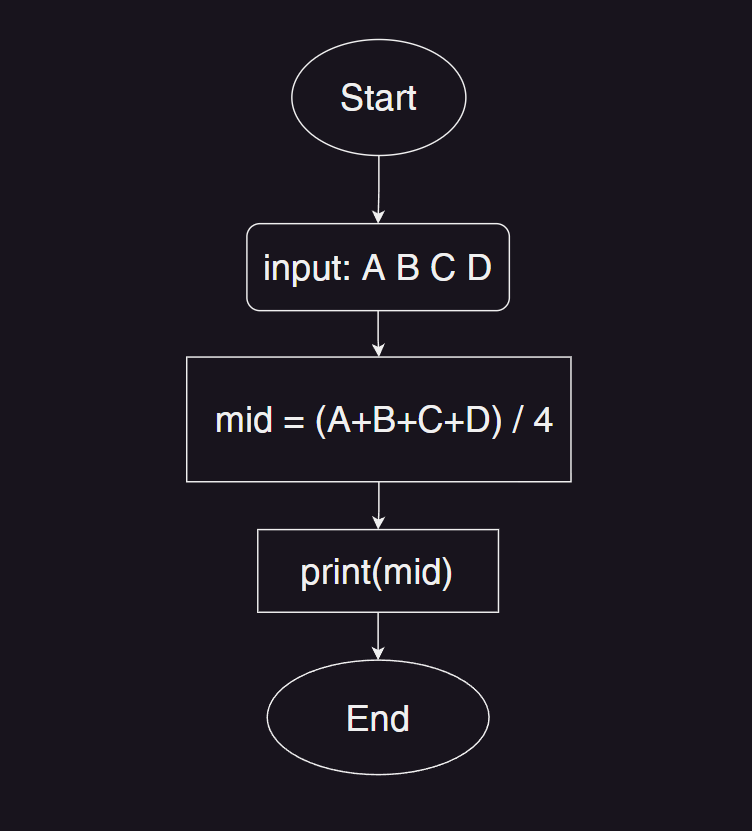
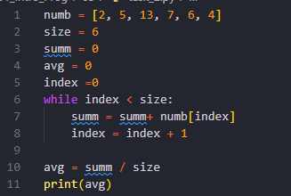
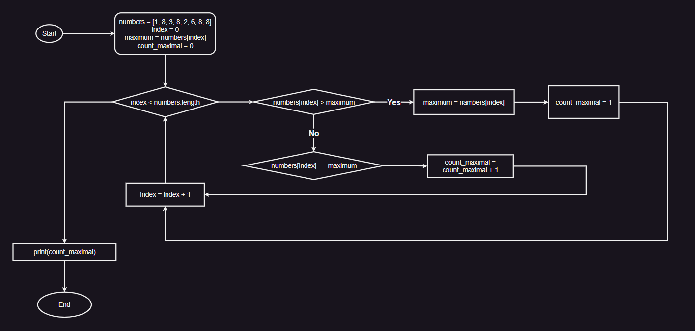

# Домашние задние 
## Урок 1
### Задача 3. Составить блок-схему нахождения среднего арифметического из 4-х чисел.
### 
### Задача 6. Составить блок-схему нахождения факториала N.
### 

## Урок 2

## Урок 3 Итоговый проект исходные файлы находятся в папке 03  
### Задача 2. Напишите псевдокод по блок-схеме
### 
### Задача 5. Составьте блок-схему на основе псевдокода
### 