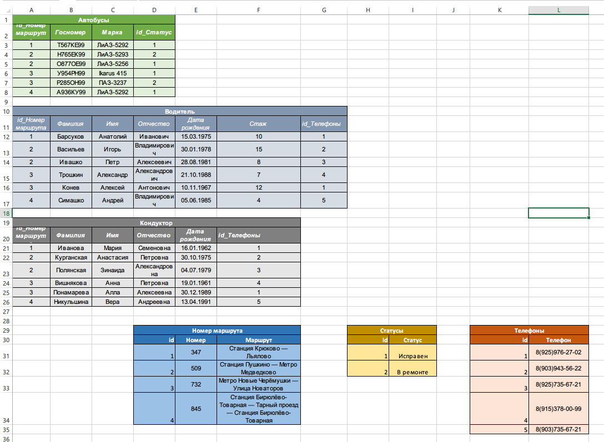

# Домашняя работа

## Урок 1. Знакомство с базами данных

+ Составьте таблицы для хранения сведений об общественном транспорте
+ [Таблица на гугл диске](https://docs.google.com/spreadsheets/d/1U_b_5STw5R66dX11CDcRjKcUc13pmPDtRW1w02Ek90E/edit?usp=sharing)
+ — Можно на примере автобусов.
+ — При составлении таблиц не берите слишком много сущностей. Ориентируйтесь на структуру типа: «У нас есть автобусы на разных маршрутах, у автобуса есть водитель, также в автобусе работает кондуктор». Более сложные/глубокие структуры пока лучше не брать.

