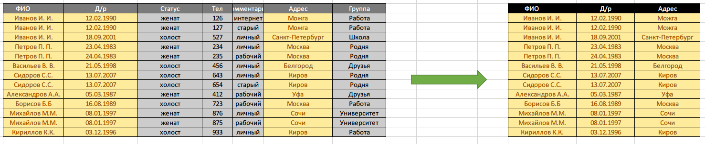
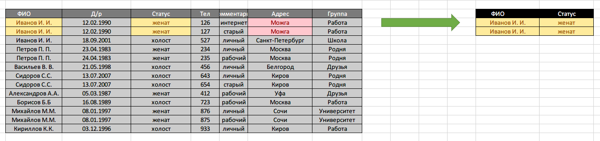
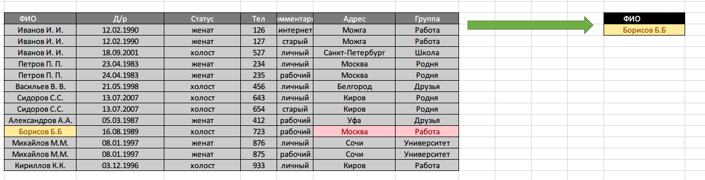
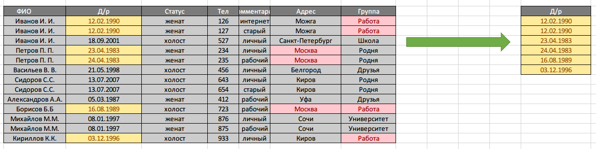
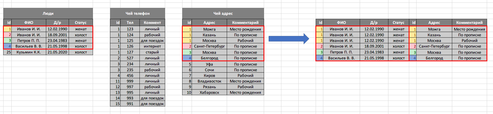
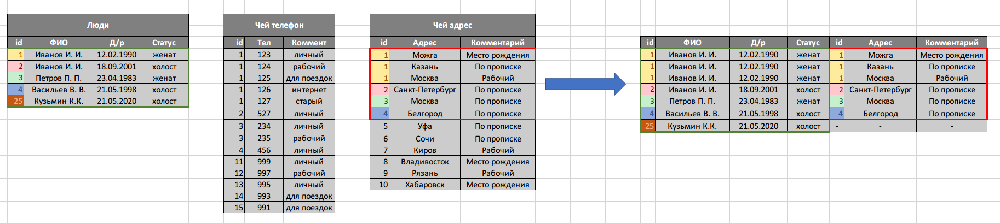
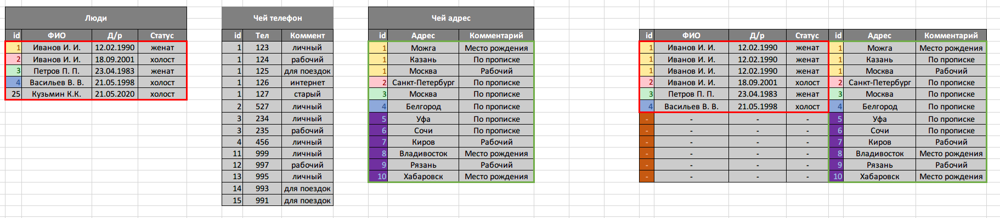
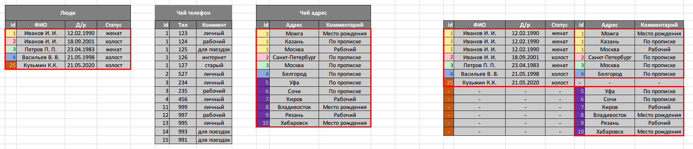
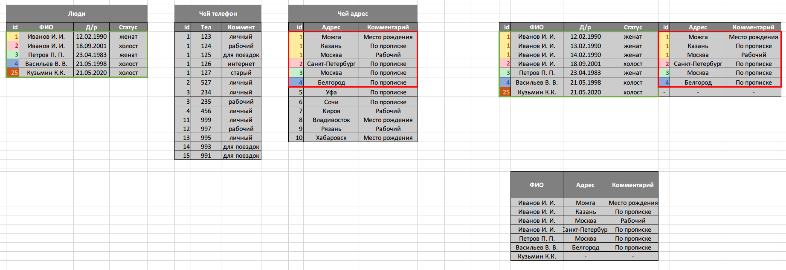

# Домашняя работа

## Урок 2. Работа с данными из разных таблиц

+ Чему будет равна выборка:
+ [Таблица на гугл диске](https://docs.google.com/spreadsheets/d/1U_b_5STw5R66dX11CDcRjKcUc13pmPDtRW1w02Ek90E/edit?usp=sharing)

1. SELECT ФИО, Д/р, Адрес FROM Общий список

2. SELECT ФИО, Статус FROM Общий список WHERE Адрес = «Можга»

3. SELECT ФИО FROM Общий список WHERE Адрес = «Москва» AND Группа = «Работа»

4. SELECT Д/р FROM Общий список WHERE Адрес = «Москва» OR Группа = «Работа»

+ Что будет результатом следующих JOIN’ов:

1. INNER JOIN Люди, Адреса ON id = Чей адрес

2. LEFT JOIN Люди, Адреса ON id = Чей адрес

3. RIGHT JOIN Люди, Адреса ON id = Чей адрес

4. FULL JOIN Люди, Адреса ON id = Чей адрес

+ Дополнительное задание. Что будет результатом выборки:

+ SELECT ФИО, Адрес, Комментарий FROM Люди RIGHT JOIN Адреса ON id = Чей Адрес

