# Домашняя работа

## Урок 3. Создание структуры базы данных

Опишите базу данных для школьного кабинета, в рамках которой можно фиксировать, кто и в какое время сидел за той или иной партой.

[Таблица](https://docs.google.com/spreadsheets/d/1U_b_5STw5R66dX11CDcRjKcUc13pmPDtRW1w02Ek90E/edit?usp=sharing)

+ — Место ученика — это ряд, парта, вариант.
+ — В течение одного дня у разных классов бывает несколько уроков.
+ — Создайте минимум 3 таблицы: «Кабинет», «Ученик» и сводная таблица, где отображаются парты и ученики.
+ — Используйте поля «началоурока» и «конецурока» с типом данных TimeStamp.

### Таблица Ученики

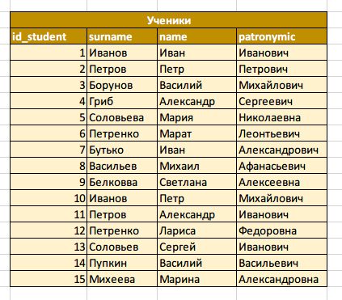

+ Описание таблицы

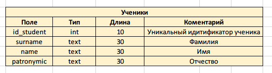

### Таблица Классы

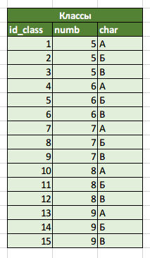

+ Описание таблицы

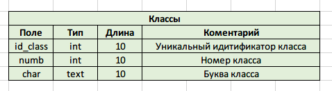

### Таблица Кабинет

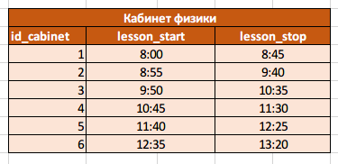

+ Описание таблицы

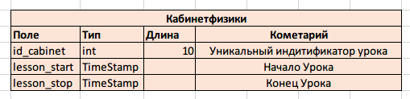

### Таблица Место ученика

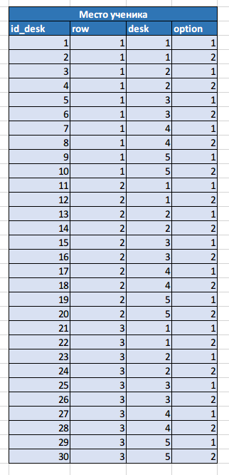

+ Описание таблицы

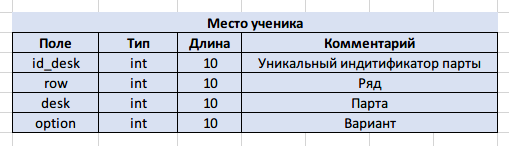

### Сводная таблица

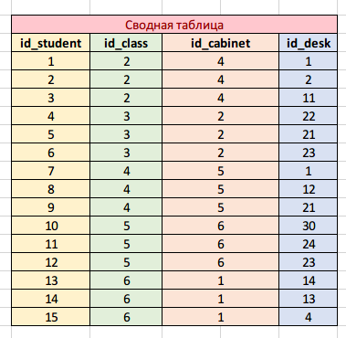

+ Описание таблицы

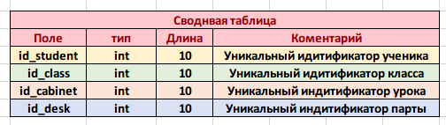

### Полная сводная таблица

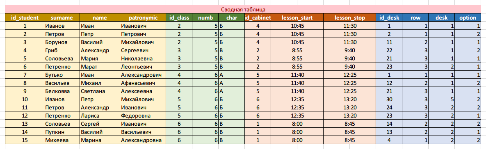
